# 🚀 SK네트웍스 Family AI 과정 14기 1팀 - Final Project
<a id="toc-site"></a>
## 🔗 운영 사이트: [https://code-nova.dev](https://code-nova.dev)

### **🎫 게스트 계정 (체험용)**
| 항목 | 정보                      |
|:-----|:------------------------|
| **계정 ID** | `guest1`                |
| **비밀번호** | `guest1234@`            |
| **유효기간** | 2025년 10월 2일까지          |
| **설명** | 미리 관리자가 승인해둔 체험용 계정입니다. |

<a id="toc-demo"></a>
## 🎥 시연 영상
[](https://youtu.be/YZnAioNsNyo?si=UUYjFH3L-jXAsDGC)

## **❇️ 프로젝트명 : CodeNova**  
LLM 활용 내부 고객 업무 효율성 향상을 위한 API 전문 사내 개발자 지원 AI 기반 문서 검색 시스템  

---


## 🙌 팀원

|                                                     | 이름 | 역할 | 담당 업무                                                           |
|:---------------------------------------------------:|:-----|:-----|:----------------------------------------------------------------|
|    | **이나경** | PM | 프로젝트 총 일정 관리, 문서 검색 기능, 검색 성능 평가, 최종 발표                         |
|     | **김준기** | PM | CI/CD 및 배포 및 모니터링, 사내 내부 문서 FastAPI 설계, sLLM Finetuning         |
|  | **정민영** | 팀원 | Langgraph 설계, sLLM Finetuning, Langgraph/sLLM 성능 테스트, README 작성 |
|     | **안윤지** | 팀원 | 마이페이지 기능 개발, Langgraph 개선 및 성능 테스트, 프로젝트 리소스 관리                 |
|    | **이원지희** | 팀원 | 로그인/회원가입/승인대기/승인거부 페이지 개발                                       |
|    | **김재우** | 팀원 | 웹페이지 템플릿(프론트엔드) 제작, 커뮤니티 페이지 개발                                 |

---

## 📑 목차
- [실행 방법](#toc-setup)
- [프로젝트 개요](#toc-overview)
- [시장조사 및 BM](#BM)
- [기술 스택](#toc-tech)
- [시스템 아키텍처](#toc-arch)
- [주요 구성요소](#toc-services)
- [주요 기능](#toc-features)
- [프로젝트 User-Flow](#toc-userflow)
- [AI 모델링](#toc-aimodel)
- [AI 모델 경쟁력 분석](#toc-competitive)
- [피드백 수용 및 개선 내용](#toc-feedback)
- [사용 데이터](#toc-data)
- [데이터 전처리 과정](#toc-preprocess)
- [ERD](#toc-erd)
- [프로젝트 성과 및 향후 보완점](#toc-achievement)
- [향후 과제](#toc-future)
- [팀원 회고](#toc-retrospective)

## 🚀 실행 방법
<a id="toc-setup"></a>

### **📋 사전 준비**
먼저 https://github.com/SKNETWORKS-FAMILY-AICAMP/SKN14-FINAL-1Team 깃 클론

### **🔧 Django 설정**

#### **1단계: 의존성 설치**
```bash
cd web
pip install -r requirements.txt
```

#### **2단계: 환경변수 설정 (.env 파일)**
| 환경변수 | 설명 |
|:---------|:-----|
| `OPENAI_API_KEY` | GPT LLM 호출을 위한 API 키 |
| `DJANGO_SUPERUSER_PASSWORD` | Django 관리자 계정 생성 시 사용하는 비밀번호 |
| `AWS_SECRET_ACCESS_KEY` | S3 접근을 위한 AWS 자격 증명 |
| `AWS_ACCESS_KEY_ID` | S3 접근을 위한 AWS 자격 증명 |
| `AWS_S3_REGION_NAME` | S3 버킷이 위치한 AWS 리전 |
| `AWS_STORAGE_BUCKET_NAME` | 채팅 이미지 저장용 S3 버킷 이름 |
| `AWS_STORAGE_BUCKET_NAME2` | 프로필 이미지 저장용 S3 버킷 이름 |
| `MYSQL_DATABASE` | MySQL 데이터베이스 이름 |
| `MYSQL_USER` | MySQL 접속용 사용자 이름 |
| `MYSQL_PASSWORD` | MySQL 사용자 비밀번호 |
| `MYSQL_HOST` | MySQL 서버의 호스트 주소 |
| `MYSQL_PORT` | MySQL 서버 포트 번호 (기본 3306) |
| `SLLM_API_URL` | SLLM 서빙 FastAPI 서버의 URL |

#### **3단계: 데이터베이스 설정**
**중요**: MySQL 계정 정보는 Django의 codenova 앱에서 `settings.py`의 DB 설정에도 동일하게 적용되어있는지 확인해야 합니다.

```bash
python manage.py makemigrations && python manage.py migrate && python manage.py create_superuser_local && python manage.py runserver
```

#### **4단계: 관리자 계정 및 사용자 승인**
| 항목 | 내용 |
|:-----|:-----|
| **관리자 계정** | 아이디: `admin` / 비밀번호: `DJANGO_SUPERUSER_PASSWORD` 환경변수 값 |
| **관리자 접속** | 루트 URL 뒤에 `/admin`을 붙여 접속 |
| **사용자 승인/거절** | 어드민 사이트의 `approval logs`에서 사용자 클릭 후 승인/거절 처리 |

### **⚡ FastAPI 설정**

#### **1단계: 의존성 설치**
```bash
cd ai 
pip install -r requirements.txt
```

#### **2단계: 환경변수 설정 (.env 파일)**
| 환경변수 | 설명                                                                          |
|:---------|:----------------------------------------------------------------------------|
| `VLLM_API_URL` | runpod vllm url (qwen3 파인튜닝 모델 서빙 vllm url)                                 |
| `VLLM_MODEL` | SKN14-Final-1Team/qwen3-8b-informal-formal-merged-09-19 (파인튜닝한 모델 허깅페이스 경로) |
| `VLLM_API_KEY` | runpod vllm api key (runpod setting에서 api key 생성 가능)                        |

#### **3단계: FastAPI 실행**
```bash
uvicorn main:app --reload --port 8001
```

---

## 📌 프로젝트 개요
API 문서는 방대한 문서와 복잡한 구조로 인해 개발자가 필요한 정보를 신속하게 찾기 어렵습니다.  

본 프로젝트는 **RAG + LLM 기반 문서 검색 시스템**을 구축하여 내부 개발자의 **검색 효율성**과 **업무 생산성**을 높이는 것을 목표로 합니다.  

이 시스템은 아래와 같이 크게 **API 전문 어시스턴트**과 **사내 내부 문서 전문 SLLM 챗봇**으로 구성됩니다.  

- **API 전문 어시스턴트**:  
  - **OpenAI GPT-4o 기반 챗봇**
  > API Q&A, 예제 코드, 오류 해결 등 **API 문서에 대한 전반적인 질의응답**을 지원하는 챗봇. 사용자가 질문을 입력하면 관련 문서를 벡터 DB에서 검색하여 최적의 답변을 제공합니다.  

  - **API 문서 원문 검색**:  
  > 사용자가 입력한 검색어에 대한 **의미 기반 검색**을 통해 API 문서 원문 링크를 빠르게 찾을 수 있는 기능. 
  > 
  > 사용자가 특정 키워드나 의미를 입력하면 관련 원문 링크를 제공하여 구체적인 정보에 쉽게 접근할 수 있게 합니다.  

- **사내 내부 문서 전문 sLLM 챗봇**:  
  > 사내 정책·규정·기술 자료를 검색할 수 있으며, **권한 기반 보안 필터**를 적용해 사용자의 직급과 부서에 맞는 문서만 열람 가능하도록 합니다.
  >
  > 또한, **사내 전용 말투·용어·보고체계**를 반영하여 내부 직원들이 친숙하고 실질적인 도움을 받을 수 있도록 최적화된 대화 경험 제공합니다.
  > 
  > 그리고 사용자가 공손/친구 말투 중 선택할 수 있도록 하여, 원하는 형태의 챗봇 응답을 받을 수 있도록 하는 사용자 경험을 제공합니다. 


---

<a id="BM"></a>
## 📊 시장 조사 및 BM

### 시장 규모
- **글로벌 AI 소프트웨어 시장**: 2028년 6,788억 달러 전망  
- **국내 AI 산업**: 2024년 6조 3,000억 원 (응용 소프트웨어 2조 6,700억 원, 최대 비중)

### 타겟 고객
- API(구글 등)를 활용하는 **사내 개발자 / 엔지니어**
- API 연관 서비스 및 연동 솔루션 관련 부서

### 비즈니스 모델 (BM)
- **구독형 라이선스**: 월/연 단위 과금, 기능별·사용자 수 차등 요금제
- **엔터프라이즈 계약**: 맞춤형 데이터 연동, 기술 지원 포함  

---


## ⚙️ 기술 스택

<a id="toc-tech"></a>

| 항목                  | 내용                                                                                                                                                                                                                                                                                                                                                                                                                                  |
|:--------------------|:------------------------------------------------------------------------------------------------------------------------------------------------------------------------------------------------------------------------------------------------------------------------------------------------------------------------------------------------------------------------------------------------------------------------------------|
| **Frontend**        |     |
| **Backend**         |     |
| **DB**              |                                                                                                                                                                                                                              |
| **Infra**           |       |
| **CI/CD**           |                                                                                                                                                           |
| **Embedding Model** |                                                                                                                                                                                                                                                                                                                          |
| **LLM Model**       |  -FF6F00?style=for-the-badge&logo=alibabacloud&logoColor=white) |
| **Orchestration**   |   |
| **Evaluation**      |  |
| **Collaboration**   |     |
| **Development**     |   |

---

## ⚙️ 시스템 아키텍처

<a id="toc-arch"></a>

> 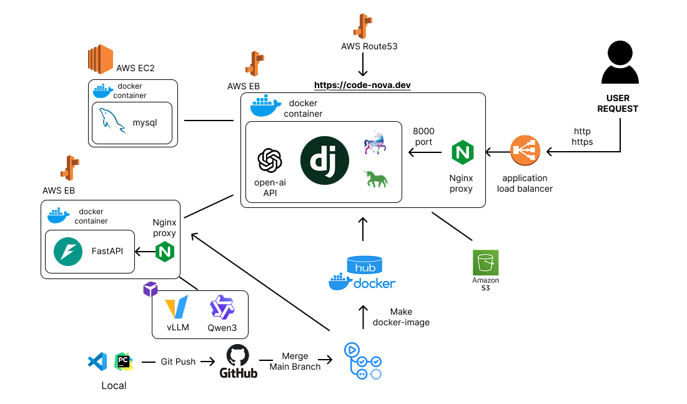
>
> 본 시스템은 Django 기반 웹 애플리케이션, FastAPI 서비스, LLM(OpenAI GPT-4), sLLM(Qwen3-8B 파인튜닝 모델)로 구성됩니다.  
> 
> 대부분의 애플리케이션은 **AWS Elastic Beanstalk** 환경에서 **Docker 컨테이너** 형태로 배포됩니다.  
> 
> 다만, **MySQL DB는 별도의 AWS EC2 인스턴스** 위에서 Docker 컨테이너로 운영됩니다.  

---

### 🔹 주요 구성 요소

<a id="toc-services"></a>

1. **웹 애플리케이션 계층**
   - **Django (Gunicorn/Uvicorn)**: 메인 백엔드 프레임워크, OpenAI GPT-4 API 연동
   - **Nginx Proxy + Application Load Balancer (ALB)**: 외부 요청을 HTTPS/HTTP로 수신 후 Django 컨테이너로 전달
   - **AWS Route53**: 도메인 관리 및 HTTPS 라우팅 (`https://code-nova.dev`, `http://sllm.code-nova.site`)

2. **데이터베이스 계층**
   - **MySQL (별도 AWS EC2 인스턴스 내 Docker 컨테이너)**: 사용자 계정 정보, 채팅 내역, 커뮤니티 내용 등 저장
   - **Chroma Vector DB**: 챗봇 RAG 검색용 벡터 데이터베이스

3. **스토리지 계층**
   - **AWS S3**: 채팅 이미지, 프로필 이미지 파일 저장소

4. **AI 모델 계층**
   - **LLM (OpenAI GPT-4)**: 주 대화 모델로서 범용적인 질의응답 처리
   - **sLLM (Qwen3-8B Fine-tuned, RunPod + vLLM)**: 파인튜닝된 도메인 특화 모델, RunPod GPU 환경에서 vLLM을 통해 서빙  
   - **FastAPI 서비스**: sLLM inference API 제공 (Nginx Proxy와 연동)

5. **CI/CD 파이프라인**
   - **GitHub → DockerHub → AWS EB**
   - 로컬 개발(예: PyCharm) 후 GitHub에 Push
   - `main` 브랜치 Merge 시 **GitHub Actions**가 Docker Image를 빌드 및 DockerHub에 업로드
   - Elastic Beanstalk이 최신 이미지를 Pull 받아 자동 배포

---

## ✔️ 주요 기능
<a id="toc-features"></a>
### **🌎 API 전문 어시스턴트**

- **OpenAI GPT-4 기반 멀티모달 챗봇**:  

  > 구글 API Q&A, 예제 코드, 오류 해결 등 **구글 API 문서 전반에 대한 질의응답**을 지원합니다.  
  > 
  > 텍스트 입력뿐 아니라 **오류 코드 스니펫**이나 **API 관련 캡처 이미지**도 인식하여, **API 사용법 / 오류 해결법 / 예시 코드**를 함께 제공합니다.
  >
  > 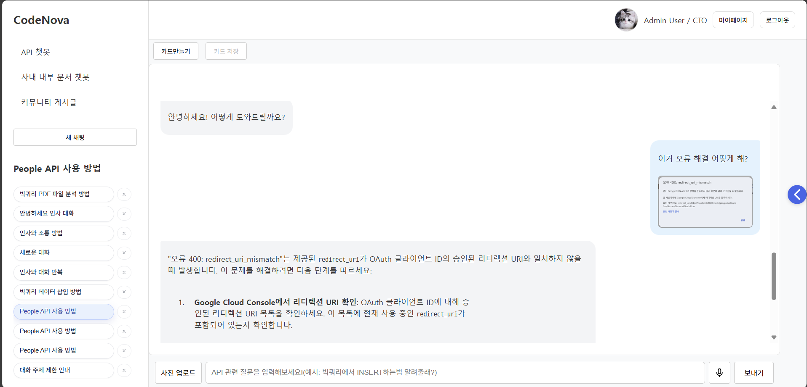
  >
  > 또한 **이전 대화 맥락**을 반영하여 연속적인 대화에서도 정확한 답변을 유지합니다.  
  >
  > 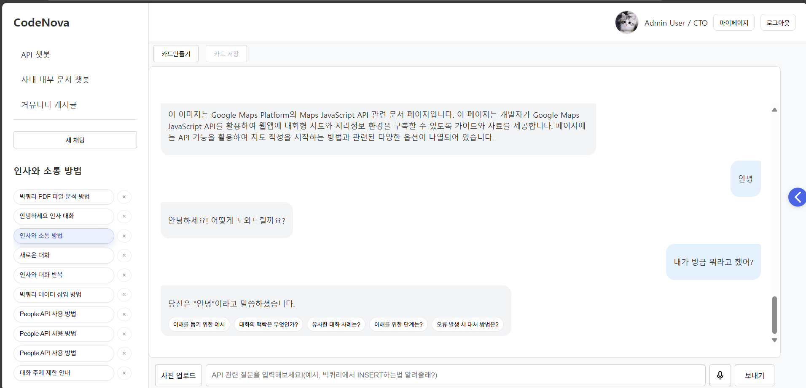

- **API 질문 분기 처리**:  
  > 입력된 질문 유형에 따라 효율적으로 분기 처리합니다.  
  >
  > ◆ **API 관련 질문** → 문서 검색 + GPT-4 기반 응답
  > 
  > 
  > 
  >
  > ◆ **일상 대화** → 일반 대화 모드로 응답
  > 
  > 
  > 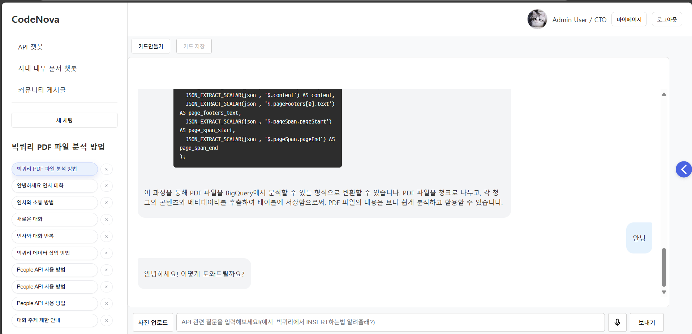
  > ◆ **지원하지 않는 질문(예: GitFlow, 사내 업무 질문 등)** → "지원 범위 외 질문"으로 안내  
  > 
  > 
  > 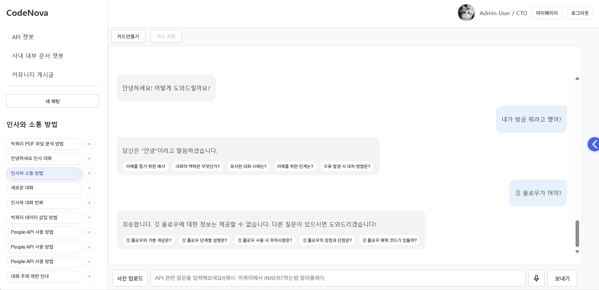

- **음성 입력 지원 (Whisper 연동)**:  
  > OpenAI **Whisper 모델**을 연동하여, 사용자의 **음성 입력을 실시간으로 텍스트 변환**하고  
  > 변환된 내용을 기반으로 질의응답을 수행합니다.  
  > 
  > 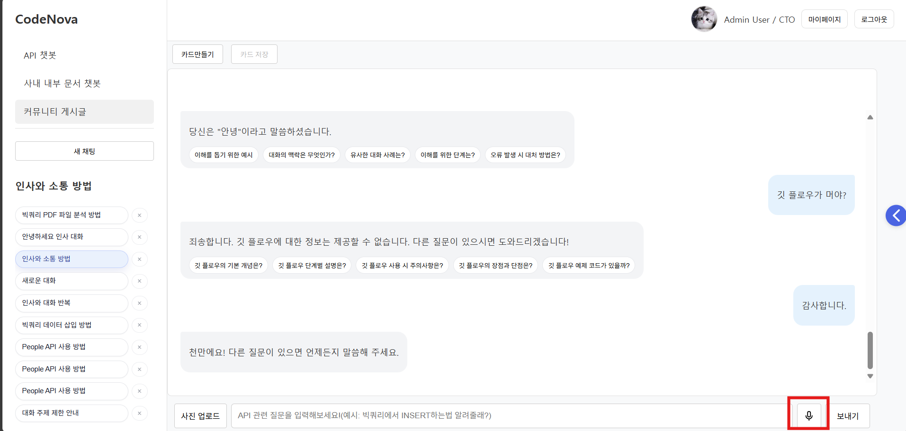

- **API 문서 검색 기능**:  
  > **유사도 기반 검색**을 통해 관련된 문서 원문을 빠르게 찾아 원문 링크를 보여줍니다.
  > 
  > 검색된 문서 중 **가장 유사도가 높은 Top N개 문서**를 사용자에게 제공하며, **N 값은 사용자가 직접 조절 가능**합니다.  
  > 
  > 또한 관련 원문 링크를 함께 제공하여, 세부 정보를 쉽게 확인할 수 있도록 지원합니다.
  > 
  > 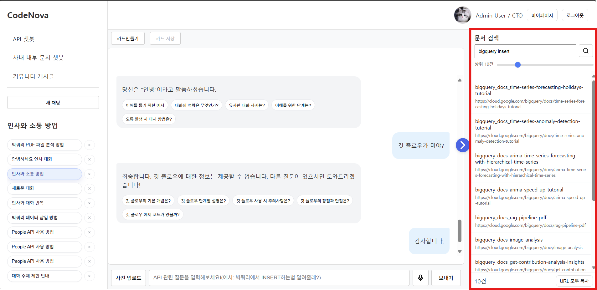

### **🧑‍💼 사내 문서 sLLM 챗봇**

- **모델 및 학습 특성**:  
  > **Qwen3-8B 모델**을 **LoRA 방식으로 파인튜닝**하여 구축된 챗봇입니다.  
  > 
  > 학습 과정에서 **일상 대화**, **문서 검색 질의응답(RAG)**, 말투(공손/친구)뿐만 아니라, **멀티턴 TOOL CALL 패턴**까지 반영하여, 대화 맥락을 고려한 자연스러운 응답이 가능합니다.  
  > 
  > 추가로, 사용자가 원하는 말투를 선택할 수 있도록 지원합니다.  

- **내부 문서 검색 및 응답**:  
  > **사내 문서 검색**과 관련된 질문은 **RAG 기반 검색**을 통해 정확한 답변을 제공합니다.  
  >  
  > 이 과정에서 **직급 및 권한에 따른 문서 접근 제어** (벡터 db 분리 및 tool 제한)를 적용해 보안이 강화된 검색 환경을 보장합니다.
  > 
  > 아래는 프론트엔드팀원이 백엔드 문서에 접근할 수 없고, 프론트엔드 문서만 접근할 수 있는 실제 예시 이미지입니다.
  > 
  > 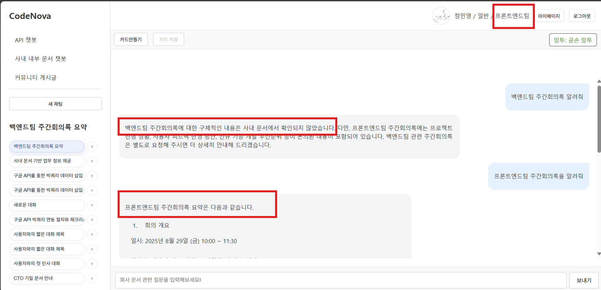

- **일상 대화 응답**:  
  > 사내 문서 검색 이외의 **일상 질문**에 대해서는, 파인튜닝된 **Qwen3-8B 모델 자체**의 대화 능력을 활용하여 응답합니다.  
  > 
  > 

- **커뮤니케이션 톤**:  
  > **사내 말투와 용어**를 반영해 조직 내부 커뮤니케이션에 맞는 톤과 스타일로 응답하며,  
  >
  > 사용자 선택에 따라 **공손한 말투**와 **친구 말투 톤** 모두 자연스럽게 지원합니다.
  > 
  > 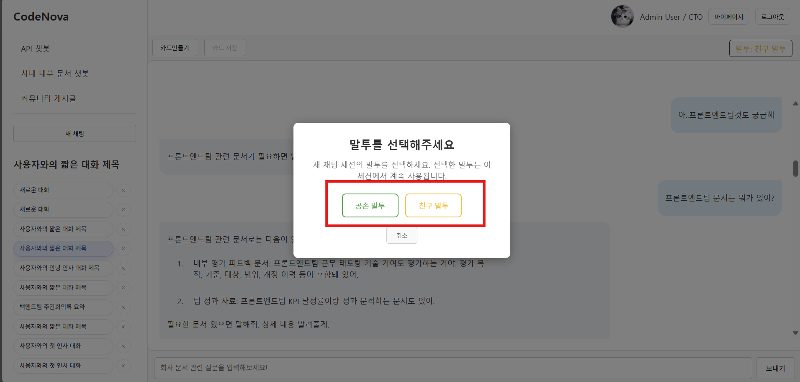
  > 
  > ◆ 공손한 말투 예시
  > 
  > 
  > 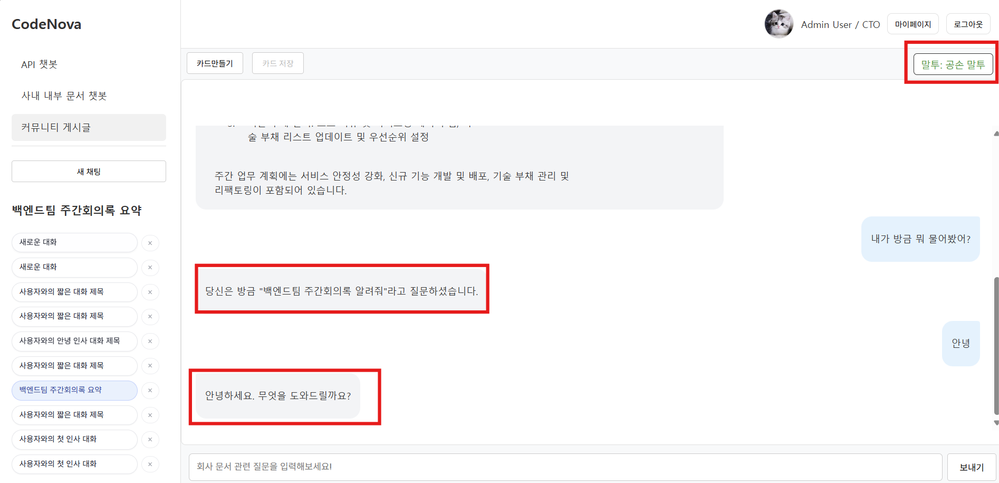
  > 
  > ◆ 친구 말투 예시
  > 
  > 
  > 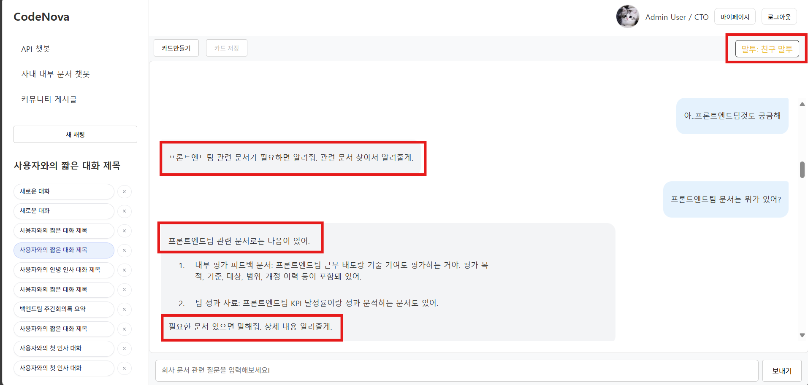


---

### **⚙️ 부가기능**

- **대화 카드 저장**:  
  > 팀 내에서 중요한 **코드 자산**이나 **API 사용 예시** 등을 **대화 카드**로 저장할 수 있습니다.  
  > 
  > 
  > 
  > 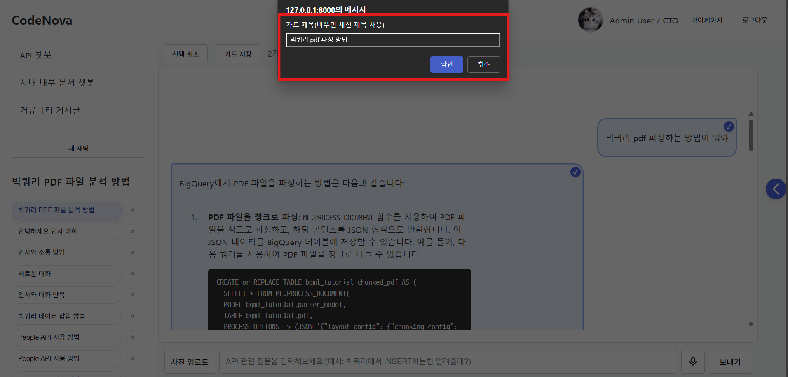
  > 
  > 저장된 카드는 **마이페이지에서 확인 가능**하며, **자세히 보기** 기능을 통해서 저장한 대화 내용을 확인할 수 있고, **채팅 보러가기** 기능을 통해 해당 카드가 속한 대화 세션으로 바로 이동할 수 있습니다.  
  > 
  > 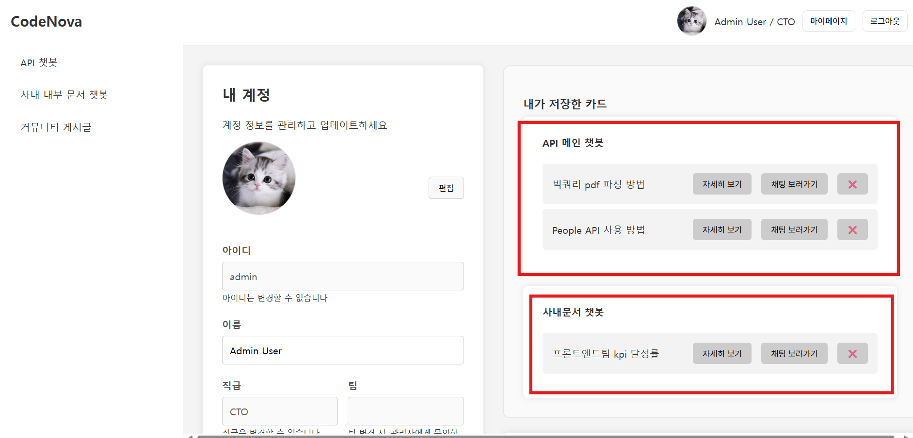
  > 
  > 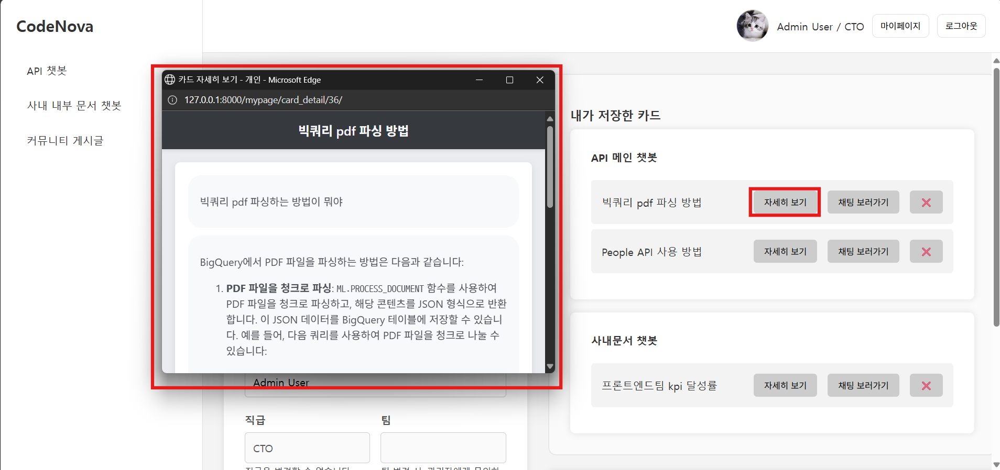
  > 
  > 이를 통해 팀 내 지식 관리와 코드 자산 공유가 촉진되어 업무 효율성을 높입니다.  

- **API 키 관리**:  
  > API 키를 **저장, 수정, 삭제, 복사**할 수 있는 기능으로, 사용자는 자신의 API 키를 손쉽게 관리할 수 있습니다.
  > 
  > 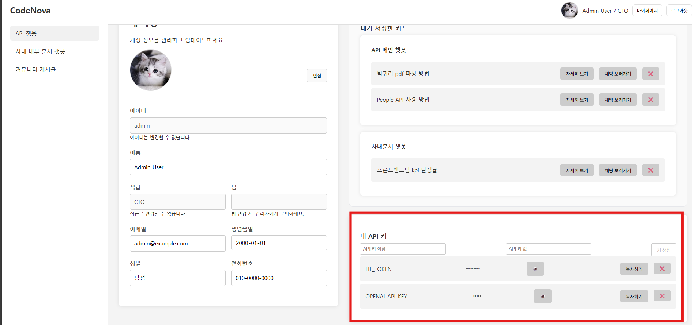

- **커뮤니티**:  
  > 사용자들이 **코드 예제, API 사용법, 문제 해결**뿐 아니라 **일상적인 주제**에 대해서도 자유롭게 의견을 나눌 수 있는 커뮤니티 기능을 제공합니다.  
  > 
  > 이를 통해 개발자 간의 정보 공유는 물론, 친목 도모와 소통의 장으로도 활용할 수 있습니다.  
  > 
  > 커뮤니티 내 **베스트 게시글**은 별도로 선별되어 게시판 상단에 노출됩니다.
  > 
  > 


---

## ♒ 프로젝트 User-Flow
<a id="toc-userflow"></a>
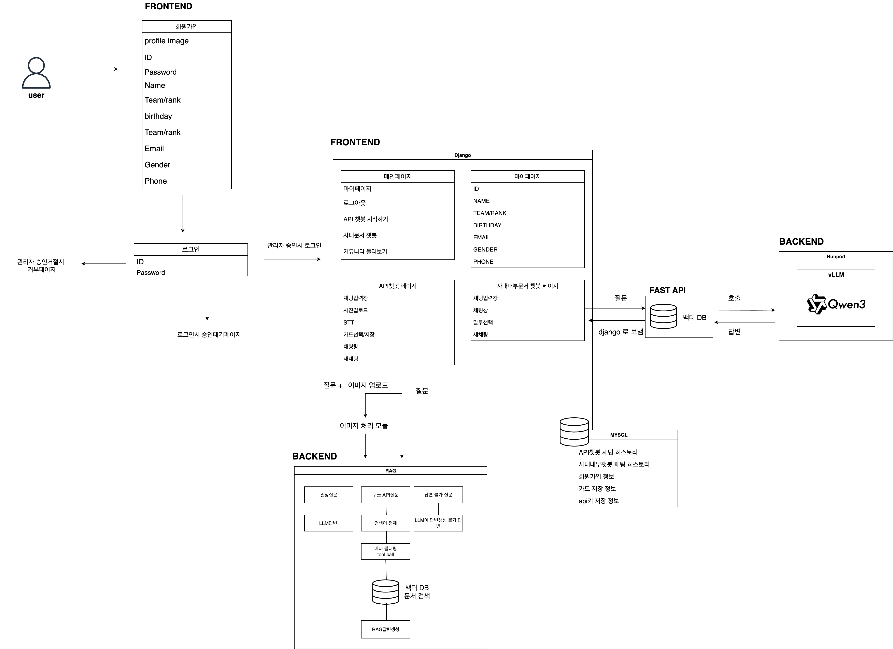
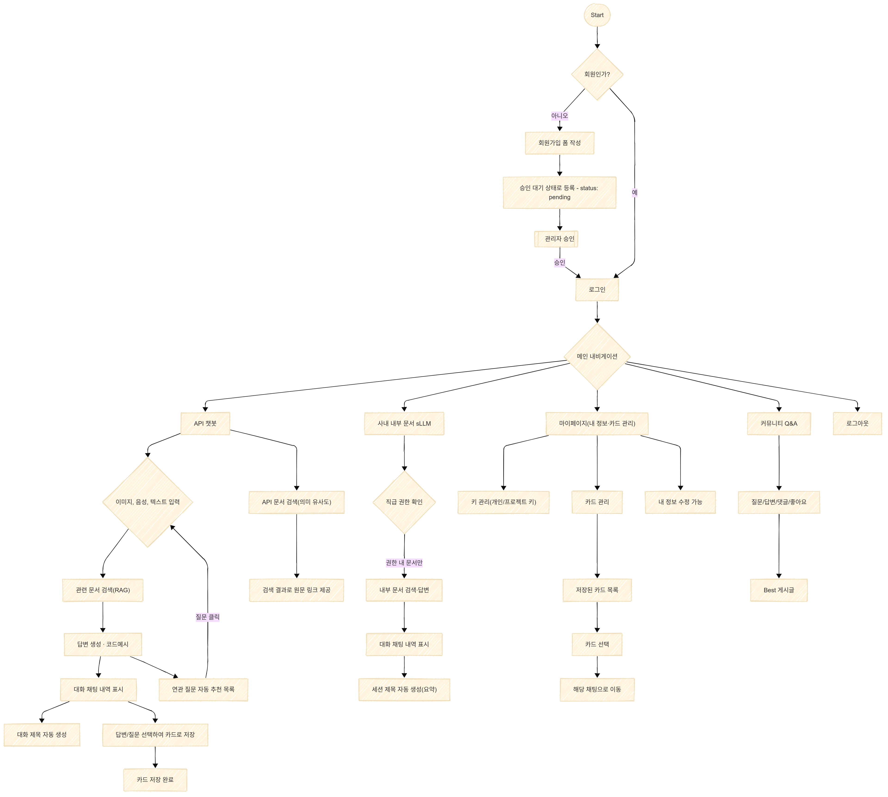


### 🧭 유저 플로우 정리

1. **회원가입 및 승인**
   - 신규 유저는 회원가입 후 `status: pending` 상태로 등록
   - 관리자가 승인해야 로그인 가능

2. **메인 내비게이션: 로그인 후 유저는 네 가지 주요 기능을 이용할 수 있음**
   - **API 챗봇 (API Q&A)**
   - **사내 문서 검색 sLLM**
   - **마이페이지 (키 관리 / 카드 관리 / 내 정보 수정)**
   - **커뮤니티 Q&A**

3. **API 챗봇 (API Q&A)**
   - 입력: 이미지 / 음성 / 텍스트
   - 관련 문서 검색 (RAG) 및 응답 생성
   - 답변 생성 후 대화 내용 표시
   - 유저가 원하는 경우 **대화 카드 저장** 가능
   - 저장된 카드는 마이페이지에서 확인 및 재접속 가능

4. **API 원문 링크 검색**
   - 입력: 텍스트
   - 유사도 기반으로 원문 링크 검색 기능 제공 (검색어 입력 시 관련 원문 링크 제공)
   - 검색된 원문 링크 클릭 시, 해당 원문 사이트로 바로 이동

5. **사내 문서 검색 sLLM**
   - 직급 및 권한 확인 후 문서 검색 가능
   - RAG 기반 문서 답변 및 대화 내용 표시
   - 필요 시 **대화 카드 자동 저장** 기능 지원

6. **마이페이지**
   - **API 키 관리** (등록 / 수정 / 삭제 / 복사)
   - **대화 카드 관리** (목록 확인, 선택 시 해당 세션으로 이동)
   - **내 정보 수정** 가능

7. **커뮤니티 Q&A**
   - 질문, 답변, 댓글, 좋아요 기능 제공
   - **베스트 게시글**은 커뮤니티 상단에 노출
   - 개발/코드뿐 아니라 **일상 관련 주제**도 지원 → 친목 도모 가능

---

## 🔍 AI 모델링
<a id="toc-aimodel"></a>

### ① 사내 문서 기반 RAG: Qwen 모델(LoRA 파인튜닝)

### 개요

| 항목 | 내용                                                                                           |
|---|----------------------------------------------------------------------------------------------|
| 목적 | 사내 문서 기반 챗봇용 소형 LLM 파인튜닝 (업무/일상 통합)                                                          |
| 대상 모델 | Qwen3-8B(메인), Qwen2.5-7B-Instruct(비교)                                                        |
| 데이터 | `qwen3_company_train_dataset_combined.json` (팀별: Backend/Frontend/Data_AI/CTO, 말투: 공손/친구 말투) |

### 학습 설정

| 항목 | 값 |
|---|---|
| 하이퍼파라미터 | epochs=3, per_device_train_batch_size=4, grad_accum=2, lr=1e-4, optimizer=adamw_torch_fused, dtype=bfloat16, max_len=8192 |
| LoRA | alpha=32, dropout=0.1, rank=8, target=["q_proj","v_proj"], bias=none |
| 최적화 | gradient_checkpointing=True, grad_clip=0.3, warmup_ratio=0.03, scheduler=constant |
| 모니터링/출력 | log_every=10 steps, save_every=50 steps, output_dir=`qwen3-8b-informal-formal` |
| 전처리 | Qwen chat 템플릿, assistant 응답만 라벨링, 배치 최대 길이 패딩, 토큰 최대 8192 |

#### sLLM 학습 결과 요약


1. 학습 데이터 구성
   - 문서 검색 질문 → tool_call → tool_response → 모델 답변
   - 일상 질문 → 모델이 바로 답변(툴 호출 없음)

2. 학습 효과
   - 질문 유형(검색/일상)을 구분하고, 필요한 경우에만 툴을 호출하도록 학습됨

3. 실행 흐름
   - 사용자 질문 입력 → 질문 유형 판별(멀티턴 맥락 고려)
   - 검색 질문 → 툴 호출 후 결과 기반 응답
   - 일상 질문 → 바로 답변

4. 학습 결과
   - Qwen3-8B 파인튜닝 델타는 툴 기반 응답과 직접 답변을 모두 학습했으며,
     실행 시점에서도 질문에 따라 툴 호출 여부를 정확히 판단하고 응답할 수 있음

### 성능 평가

- **멀티턴 TOOL CALL 성능 평가**

> #### 평가 기준

| 지표 | 목표 | 계산 | 해석 |
|---|---|---|---|
| tool_selection | 정답과 예측의 TOOL NAME 일치 여부 평가 | 정답에 tool_call 있는 샘플 중, 예측이 맞은 개수 / 총 샘플 수 | 정확한 도구를 선택했는지 평가 |
| params_selection | 파라미터 키(TOOL CALL의 키) 일치 정도 평가 | 정답 키와 예측 키의 매칭 수 / (정답 키 수 + 예측에만 있는 키 수) | 필요한 키를 정확히 선택했고 불필요한 키를 추가하지 않았는지 평가 |
| params_value_similarity | 공통 키의 값 유사도 평가 | 형태소 Jaccard(0.6) + 문자 유사도(0.4)의 평균 유사도 | 선택된 값(TOOL CALL 키의 값)들이 얼마나 정확히 일치하는지 평가 |

> #### 평가 결과

| 모델 | tool_selection | params_selection | params_value_similarity |
|---|---:|---:|---:|
| Qwen3-8B (기본) | 79.22% | 79.22% | 77.21% |
| Qwen2.5-7B (기본) | 25.97% | 25.97% | 67.33% |
| Qwen3-8B (파인튜닝) | 98.05% | 98.05% | 88.50% |
| Qwen2.5-7B (파인튜닝) | 99.68% | 99.68% | 87.55% |


- **RAGAS 평가 (LLM+자체 데이터셋 55개)**

> #### 평가 기준

| 지표 | 설명 |
|---|---|
| Context Recall | 검색된 문맥이 질문과 기준 정답을 얼마나 잘 포괄하는지 |
| Faithfulness | 생성된 답변이 검색된 문맥에 얼마나 충실한지 |
| Factual Correctness (mode = f1) | 생성된 답변이 기준 정답과 의미적으로 얼마나 일치하는지 (F1 스코어 기반) |

> #### 평가 결과
| 모델 | context_recall | faithfulness | factual_correctness(f1) |
|---|---:|---:|---:|
| Qwen2.5-7B (파인튜닝) | 0.7697 | 0.7992 | 0.3191 |
| Qwen3-8B (파인튜닝) | 0.9273 | 0.8614 | 0.3709 |

- **자체 정량 RAG 평가**

> #### 평가 기준

| 지표 | 정의 | 점수(0~3) | 100점 환산 |
|---|---|---:|---|
| 정확도 (Accuracy) | 시스템 답변이 기준 정답과 얼마나 일치하는지 | 0~3 | (정확도 점수 / 3) × 100 |
| 재현율 (Recall) | 기준 정답의 중요한 정보를 얼마나 재현했는지 | 0~3 | (재현율 점수 / 3) × 100 |
| 구체성 (Specificity) | 세부 사항을 얼마나 구체적으로 설명했는지 | 0~3 | (구체성 점수 / 3) × 100 |

> #### 평가 결과

| 모델 | 정확도 | 재현율 | 구체성 | 평균 |
|---|---:|---:|---:|---:|
| Qwen2.5-7B (파인튜닝) | 67.27 | 70.91 | 55.76 | 64.65 |
| Qwen3-8B (파인튜닝) | 70.91 | 74.55 | 65.45 | 70.30 |

- **벡터 DB 검색 TOP_K 테스트(LLM 기반 정량적 RAG 평가)**

> #### 평가 기준

| 항목 | 목표 | 기준 | 100점 환산 |
|---|---|---|---|
| 정확도 (Accuracy) | 시스템 답변이 기준 정답과 얼마나 일치하는지 | 3점: 완벽 일치<br>2점: 약간 차이<br>1점: 핵심 맞지만 세부 누락<br>0점: 큰 차이 | (점수 / 3) * 100 |
| 재현율 (Recall) | 기준 정답의 중요한 정보를 얼마나 잘 재현했는지 | 3점: 모든 핵심 정보 재현<br>2점: 핵심 정보 재현, 세부 부족<br>1점: 핵심 정보 누락<br>0점: 많이 누락 | (점수 / 3) * 100 |
| 구체성 (Specificity) | 세부 사항(매개변수, 예시 등)을 얼마나 구체적으로 설명했는지 | 3점: 구체적 설명 및 예시 포함<br>2점: 매개변수 설명, 예시 부족<br>1점: 기본 설명만<br>0점: 세부 누락 | (점수 / 3) * 100 |
| 최종 평균 점수 | 정확도+재현율+구체성의 평균 | - | (정확도+재현율+구체성) / 3 |

> #### 평가 결과

| TOP_K 값 | 평균 정확도 | 평균 재현율 | 평균 구체성 | 전체 평균 |
|---------|---:|---:|---:|---:|
| 4       | 70.30 | 74.55 | 63.64 | 69.49 |
| 5       | 71.52 | 75.76 | 65.45 | 70.91 |
| 6       | 70.91 | 73.94 | 64.24 | 69.70 |
| **7**       | **71.52** | **77.58** | **68.48** | **72.53** |
| 8       | 63.64 | 69.70 | 63.64 | 65.66 |

> 결론: k=7일 때 가장 높은 평균 성능(72.53)을 기록하였으며, 벡터 DB 유사도 검색 시 최적의 k 값은 7로 판단됨.

### 기술적 특징 및 결론
- **기술**: bfloat16, Gradient Checkpointing, LoRA, Chat 템플릿, TOOL CALL/RESPONSE 구조, 팀별 특화 검색 도구
- **대화 처리**: 시스템/사용자 메시지 구분
- **도구 호출**: 문서 검색 기반 정확한 답변 생성
- **성과 분석**: 베이스 대비 TOOL CALL 대폭 개선(Qwen2.5-7B: +73.71%p, Qwen3-8B: +18.83%p). 파인튜닝 후 Qwen2.5-7B는 tool_selection 1%p 높고, Qwen3-8B는 value_similarity 1%p 높음
- **최종 선정**: RAG 전반 우수한 Qwen3-8B 파인튜닝 모델
- **활용**: 팀별 특화 문서 검색, 정확한 RAG 업무 답변, 일상 대화 활용
- **개선 방향**: 질문 유형 확대, 실시간 문서 업데이트 반영, 사용자 피드백 기반 개선


## ② LangGraph 기반 멀티모달 RAG 챗봇: GPT-4 + 하이브리드 검색

### 개요

| 항목 | 내용 |
|---|---|
| 모델 | GPT-4(4o, 4o-mini 혼합, OpenAI API) |
| 목적 | API 문서 기반 멀티모달 질의응답 |
| 선정 이유 | 멀티모달 강점, JSON 모드/함수호출로 구조화 출력, temperature=0 재현성, OpenAI 생태계 호환, 4o-mini로 비용/지연 최적화, 엔터프라이즈 적합성 |

### 아키텍처/흐름


| 항목 | 내용                                                                                                                                     |
|---|----------------------------------------------------------------------------------------------------------------------------------------|
| 워크플로우 | 이미지 분석 → 질문 분류(api/basic/none) → 쿼리 추출/분리 → LLM 툴 호출(쿼리에 대한 api tags 자동 선택) → 하이브리드 검색 → 답변 생성 → 품질 평가 → (bad 시) 검색 쿼리 재생성 & 재검색 후 재답변 |
| 검색 | Chroma + BGE-m3(가중 0.8, normalize=True) + BM25(가중 0.2), 태그별 BM25 인덱스 캐싱(pkl)                                                           |
| 재시도 전략 | 초기(text_k=5, qa_k=20) → 재검색(text_k=15, qa_k=30)                                                                                        |

### 주요 설정

| 항목 | 값 |
|---|---|
| 메인/분류/추출 | GPT-4o(temperature=0), 쿼리 추출은 JSON 모드 |
| 품질 평가 | GPT-4.1(temperature=0) |
| 임베딩/저장소 | BAAI/bge-m3 + Chroma(원문/QA) |
| 최대 재시도 | 1회 |
| 메모리/히스토리 | MemorySaver, 최근 4개 메시지 유지 |
| 지원 API | 구글 API 11개 태그 |

### 세부 기능

| 기능 | 설명 |
|---|---|
| 멀티모달 | 이미지 자동 분석·텍스트 통합, 이미지-텍스트 연관 질의 처리, S3 이미지 저장/URL 관리 |
| 지능형 검색 | LLM이 적절한 API 태그를 자동 선택하여 검색 |
| 품질 보장 | good/bad 평가, 부정적/회피적 답변 감지, 대체 쿼리 생성 및 재검색 |

### LangGraph 구조 변경사항 / 성능 테스트

#### **1단계: 벡터 DB 구조 선정 (원문 vs QA vs 하이브리드)**

> **평가 조건**
- **합성 데이터셋**: RAGAS를 통해 생성한 20개 합성 질문셋
- **평가 모델**: GPT-4.1-mini
- **평가 지표**:
  - **Context Recall**: 검색된 문맥이 질문과 기준 정답을 얼마나 잘 포괄하는지
  - **Faithfulness**: 생성된 답변이 검색된 문맥에 얼마나 충실한지
  - **Factual Correctness (F1)**: 생성된 답변이 기준 정답과 의미적으로 얼마나 일치하는지
- **평가 대상**: 동일 LangGraph 구조 (벡터 DB 검색을 tool call 통해 진행, 분류 기준 구체화)

> **평가 결과**

| 버전 | Context Recall | Faithfulness | Factual Correctness | 특징 |
|---|---:|---:|---:|---|
| 원문 | 0.6500 | 0.6013 | 0.3475 | 원문 벡터 DB만 사용 |
| QA | 0.7500 | 0.7205 | 0.3130 | QA 벡터 DB만 사용 |
| 원문+QA | 0.8000 | 0.6912 | 0.3185 | 하이브리드 방식 |

> **분석**
- **원문 기반 RAG**: Recall 0.6500, Faithfulness 0.6013, Correctness 0.3475 - 문맥 회수율이 낮고 답변 충실성도 제한적이나, Correctness는 상대적으로 안정적
- **QA 기반 RAG**: Recall 0.7500, Faithfulness 0.7205, Correctness 0.3130 - Recall과 Faithfulness는 개선되었으나 Correctness가 가장 낮음. 검색은 더 잘하지만 정답과의 의미적 일치는 다소 부족
- **원문 + QA 하이브리드**: Recall 0.8000 (최고), Faithfulness 0.6912, Correctness 0.3185 - Recall이 세 구조 중 가장 높아 질문을 더 폭넓게 커버하며, Faithfulness와 Correctness는 중간 수준으로 균형을 보임

> **결론**
- QA 기반 RAG는 질문의 맥락을 잘 회수하나 정답 일치율이 낮고, 원문 기반 RAG는 Correctness는 상대적으로 높지만 Recall이 낮아 보완이 필요
- 두 구조가 잘 처리하는 질문 유형이 상호 보완적임
- **QA 벡터 DB와 원문 벡터 DB를 모두 검색하는 하이브리드 방식**이 Recall 측면에서 가장 우수하며, 답변 충실성과 정확성에서도 균형 잡힌 결과를 보임
- **따라서 하이브리드 방식을 최종 선택**

---

#### **2단계: 하이브리드 구조 최적화**

> **평가 조건**
- **합성 데이터셋**: RAGAS를 통해 생성한 20개 합성 질문셋
- **평가 모델**: GPT-4.1-mini
- **평가 지표**:
  - **RAGAS 평가**:
    - **Context Recall**: 검색된 문맥이 질문과 기준 정답을 얼마나 잘 포괄하는지
    - **Faithfulness**: 생성된 답변이 검색된 문맥에 얼마나 충실한지
    - **Factual Correctness (F1)**: 생성된 답변이 기준 정답과 의미적으로 얼마나 일치하는지
  - **자체 정량 평가** (1~5점 척도):
    - **정답 정확성**: API 계약·권장사항 기준으로 답변의 정확성을 평가
    - **근거 충실성**: 생성된 답변이 검색된 컨텍스트에 얼마나 충실히 기반하는지 평가
    - **컨텍스트 충분성**: 검색된 컨텍스트가 답변을 뒷받침하기에 충분한지 평가

> #### **성능 테스트 결과**

- **RAGAS 평가 결과**

| 버전 | Context Recall | Faithfulness | Factual Correctness | 특징 |
|---|---:|---:|---:|---|
| VER-1 | 0.8000 | 0.6912 | 0.3185 | QA+원문 단순 병합 |
| VER-2 | 0.7500 | 0.6658 | 0.2930 | 원문→QA 순차 검색 |
| VER-3 | 0.6750 | 0.6803 | 0.3025 | 답변 평가 후 Top-K 증가 |
| VER-4 | 0.8500 | 0.8857 | 0.4135 | 답변 평가 후 HyDE 재실행 |
| VER-5 | 0.7250 | 0.6594 | 0.4650 | 답변 평가 후 2개 질문 재생성 |
| VER-6 | 0.8250 | 0.7624 | 0.5000 | 답변 평가 후 3개 검색 쿼리 재생성 |
| VER-7 | 0.8500 | 0.8857 | 0.4135 | QA+원문 앙상블 + 3개 검색 쿼리 재생성 |
| VER-8 | 0.8750 | 0.9128 | 0.5350 | 한·영 쿼리 생성 + HyDE 다국어 가상 답변 |
| **VER-9 (최종)** | **0.9250** | **0.8521** | **0.5455** | **최종 앙상블 모델 (한·영 쿼리 + HyDE + QA+원문 DB)** |

- **자체 정량 평가 결과**

| 버전 | 전체 평균 | 정답 정확성 | 근거 충실성 | 컨텍스트 충분성 | 특징 |
|---|---:|---:|---:|---:|---|
| VER-1 | 72.33 | 71.00 | 75.00 | 71.00 | QA+원문 단순 병합 |
| VER-2 | 65.00 | 63.00 | 67.00 | 65.00 | 원문→QA 순차 검색 |
| VER-3 | 63.67 | 63.00 | 65.00 | 63.00 | 답변 평가 후 Top-K 증가 |
| VER-4 | 67.33 | 65.00 | 70.00 | 67.00 | 답변 평가 후 HyDE 재실행 |
| VER-5 | 70.67 | 70.00 | 72.00 | 70.00 | 답변 평가 후 2개 질문 재생성 |
| VER-6 | 81.33 | 82.00 | 81.00 | 81.00 | 답변 평가 후 3개 검색 쿼리 재생성 |
| VER-7 | 84.67 | 84.00 | 86.00 | 84.00 | QA+원문 앙상블 + 3개 검색 쿼리 재생성 |
| VER-8 | 79.33 | 79.00 | 80.00 | 79.00 | 한·영 쿼리 생성 + HyDE 다국어 가상 답변 |
| **VER-9 (최종)** | **80.67** | **80.00** | **82.00** | **80.00** | **최종 앙상블 모델 (한·영 쿼리 + HyDE + QA+원문 DB)** |

> #### **평가 결과 분석**

**RAGAS 평가:**
- VER-9이 Context Recall 0.9250, Factual Correctness 0.5455로 모든 버전 중 가장 높은 성능 기록
- VER-6과 VER-7은 Correctness는 일정 수준 확보했으나, Recall과 Faithfulness에서 VER-9보다 낮음

**자체 정량 평가:**
- VER-6(답변 평가 후 3개 쿼리 재생성)과 VER-7(QA+원문 앙상블+3개 쿼리 재생성)이 평균 점수(81~84점)에서 가장 높게 나타남
- 그러나 추가 재실행 과정을 거쳤을 때의 결과이며, 첫 실행에서 검색 실패하는 경우가 많아 안정성이 떨어짐
- VER-9은 평균 80점으로 높은 점수를 기록

> #### **최종 모델 선정 근거**
- **VER-9** 최종 앙상블 모델 선정
- **RAGAS 우수성**: Context Recall 0.9250 (최고), Faithfulness 0.8521 (안정적), Factual Correctness 0.5455 (최고)
- **자체 평가 균형**: 전체 평균 80.67점으로 안정적 성능
- **안정성 확보**: VER-6, 7은 재실행을 반복해야 안정적인 답변을 확보할 수 있어 응답 속도가 느림
- **첫 실행 성공률**: VER-9은 첫 실행에서 검색 실패율이 낮아 빠른 응답 속도와 안정적 성능을 동시에 보장
- **통합 구성**: QA+원문 DB 앙상블, 한·영 쿼리, HyDE 기반 다국어 생성까지 통합
- **균형 잡힌 성능**: RAGAS와 자체평가 모두에서 높고 균형 잡힌 성능을 보임

> #### **Top-K 최적화**

- 비교 조건
  - 동일 합성 데이터셋: RAGAS를 통해 생성한 20개 합성 질문셋 (dataset2.csv)
  - 동일 평가 모델: GPT-4.1-mini
  - 동일 평가 지표

| RAGAS 평가 지표                     | 설명 |
|:--------------------------------|:-----|
| Context Recall                  | 검색된 문맥이 질문과 기준 정답을 얼마나 잘 포괄하는지 |
| Faithfulness                    | 생성된 답변이 검색된 문맥에 얼마나 충실한지 |
| Factual Correctness (mode = f1) | 생성된 답변이 기준 정답과 의미적으로 얼마나 일치하는지 (F1 스코어 기반) |

| 자체 정량 평가 지표 (1~5점) | 설명 |
|:----------------------|:-----|
| 응답 정확성 (Answer Correctness) | 생성 답변의 정확·완전성 평가 |
| 컨텍스트 관련성 (Context Relevance) | 검색 컨텍스트의 질문 관련성 평가 |
| 컨텍스트 충실성 (Context Faithfulness) | 답변이 주어진 컨텍스트에만 근거했는지 평가 |
| 컨텍스트 충분성 (Context Recall) | 컨텍스트가 답변에 충분한 정보 포함 여부 평가 |

- 평가 대상
  - 랭그래프 구조: QA + 원문 벡터 DB 하이브리드 VER9
  - 첫 실행 top-k 고정: 5 (원문), 20 (QA)


- RAGAS 평가 결과

| 재실행 top-k (원문, QA) | Context Recall | Faithfulness | Factual Correctness |
|---|---:|---:|---:|
| 8, 15 | 0.9250 | 0.8304 | 0.5245 |
| 10, 30 | 0.9250 | 0.8718 | 0.5535 |
| **15, 30** | **0.9250** | **0.8521** | **0.5455** |
| 20, 30 | 0.9250 | 0.9213 | 0.5465 |

- 자체 정량 평가 결과 (20점 만점)

| 재실행 top-k (원문, QA) | 평균 총점 | 응답 정확성 평균 | 컨텍스트 관련성 평균 | 컨텍스트 충실성 평균 | 컨텍스트 충분성 평균 |
|---|---:|---:|---:|---:|---:|
| 8, 15 | 18.25 | 4.30 | 4.70 | 4.55 | 4.70 |
| 10, 30 | 18.15 | 4.35 | 4.55 | 4.65 | 4.60 |
| **15, 30** | **18.35** | **4.35** | **4.65** | **4.65** | **4.70** |
| 20, 30 | 18.15 | 4.35 | 4.55 | 4.65 | 4.60 |

- 분석
  - RAGAS 평가: Top-K 조합별로 Context Recall·Faithfulness·Correctness가 모두 큰 차이를 보이지 않음 → Top-K 최적값 결정에서는 RAGAS 점수보다 자체 정량 평가를 중점 고려
  - 자체 정량 평가: 15,30 조합이 평균 총점(18.35)에서 가장 높은 성능 기록

- 최종 선정 근거
  - RAGAS 점수는 조합 간 큰 차이가 없어 세부 지표 균형과 안정성을 보여준 자체 정량 평가를 기준으로 최종 선택
  - [원문/QA] 초기 5,20 → 재시도 시 15,30 설정에서 균형적이고 높은 점수 확보; 속도와 안정성을 모두 고려하여 재검색 Top-K로 선정

> #### **운영 적용**
- Django 웹앱 통합 완료(`apichat` 앱 `utils` 모듈)
- 실시간 대화형 인터페이스 제공

> #### 향후 개선 방향
- **검색**: 시맨틱 캐시, Cross-encoder 리랭킹, embedding 모델 파인튜닝, 다국어 쿼리 지원
- **워크플로우**: 코드 생성 전용 노드 분기, API 테스트 결과 연동

> #### 참고/링크
- 전체 파인튜닝 데이터/스크립트: [GitHub 링크](https://github.com/skn-ai14-250409/SKN14-Final-1Team-AI/tree/docs/SLLM_FINETUNING/250919)
- 학습된 모델(Hugging Face): [Qwen2.5-7B](https://huggingface.co/SKN14-Final-1Team/qwen2.5-7b-informal-formal-merged-09-19), [Qwen3-8B](https://huggingface.co/SKN14-Final-1Team/qwen3-8b-informal-formal-merged-09-19)
- API 챗봇 LLM LangGraph 소프트웨어(Django 내): [GitHub 링크](https://github.com/skn-ai14-250409/SKN14-Final-1Team-Web/tree/develop/apichat/utils)


---

## 🏆 AI 모델 경쟁력 분석
<a id="toc-competitive"></a>
### **📊 LangGraph RAG vs Perplexity 비교 평가**

본 프로젝트에서 구축한 **LangGraph 기반 RAG 시스템**과 **Perplexity 모델**을 동일한 데이터셋으로 비교 평가한 결과, **우리 시스템이 Perplexity 대비 우수한 성능**을 보임을 확인했습니다.

#### **🔍 평가 방법론**

- **평가 데이터셋**: 20개 Google API 관련 질문-답변 쌍
- **평가 모델**: GPT-4.1-mini
- **평가 방식**: 평가 기준에 따라 GPT-4.1-mini 평가 모델이 채점 (각 지표별 0-3점 척도)
- **평가 항목**: 정확도(Accuracy), 재현율(Recall), 신뢰성(Reliability) 3가지 지표
- **비교 대상**: 
  - **우리 시스템**: LangGraph 기반 멀티모달 RAG (GPT-4o + 하이브리드 검색)
  - **Perplexity**: Perplexity Sonar 모델

#### **📋 평가 기준**

**평가 원칙:**
- 답변이 기준 정답과 단어/문장이 다르더라도, 핵심 내용의 의미가 같으면 높은 점수
- 기준 정답에 없는 정보, 추측, 불필요한 코드는 감점
- 핵심 정보(조건, 함수명, 파라미터 등)는 필수 포함

**평가 항목 (각 0-3점):**

| 평가 항목 | 점수 | 기준 |
|:---------|:-----|:-----|
| **정확도 (Accuracy)** | 3점 | 표현은 달라도 기준 정답과 의미가 동일 |
| | 2점 | 핵심은 일치하지만, 일부 세부 의미나 조건이 다름 |
| | 1점 | 중요한 내용은 있으나 일부 왜곡되었거나 혼동 있음 |
| | 0점 | 기준 정답과 의미적으로도 불일치하거나 틀림 |
| **재현율 (Recall)** | 3점 | 기준 정답의 핵심 정보(논리, 순서, 구성요소)를 빠짐없이 포함 |
| | 2점 | 주요 정보는 있지만 일부가 빠짐 |
| | 1점 | 핵심 정보 일부만 존재하거나 흐릿하게 표현됨 |
| | 0점 | 기준 정답의 중요한 내용이 대부분 빠짐 |
| **신뢰성 (Reliability)** | 3점 | 기준 정답 안에서만 충실하게 답변 (부가 설명 없음) |
| | 2점 | 대체로 맞지만, 부가 설명이 약간 포함됨 |
| | 1점 | 일반 지식, 예시 코드, 추측성 문장 등 기준 외 정보 포함 |
| | 0점 | 기준 정답과 무관하거나 과한 배경설명이 많음 |

#### **📈 평가 결과**

| 평가 지표 | **LangGraph RAG** | **Perplexity** | **성능 차이** |
|:---------|:------------------|:---------------|:-------------|
| **정확도 (Accuracy)** | **83.33%** | 66.67% | **+16.66%p** |
| **재현율 (Recall)** | **76.67%** | 58.33% | **+18.34%p** |
| **신뢰성 (Reliability)** | **61.67%** | 33.33% | **+28.34%p** |
| **전체 평균** | **73.89%** | 52.78% | **+21.11%p** |

#### **🎯 주요 성과**

1. **정확도 우위**: 우리 시스템이 Perplexity 대비 **16.66%p 높은 정확도** 달성
2. **재현율 우위**: 핵심 정보 누락 없이 **18.34%p 높은 재현율** 보임
3. **신뢰성 우위**: 기준 정답에 충실한 답변으로 **28.34%p 높은 신뢰성** 확보
4. **종합 성능**: **전체 평균 21.11%p 우수한 성능**으로 Perplexity 대비 명확한 경쟁력 입증

#### **💡 성능 우위 요인**

1. **하이브리드 검색**: BGE-M3 + BM25 조합으로 정확한 문서 검색
2. **품질 보장 메커니즘**: 자동 품질 평가 및 재검색 시스템
4. **도메인 특화 RAG**: Google API 문서 원문/QA셋을 벡터 DB에 넣고, 해당 내용 기반 정확한 RAG 답변

#### **🔬 평가 세부 분석**

- **우리 시스템 강점**:
  - API 문서 기반 정확한 정보 제공
  - 코드 예시와 구체적인 사용법 포함
  - 일관된 답변 품질 유지
  - 도메인 특화 지식 활용

- **Perplexity 한계**:
  - 일반적인 웹 정보 기반 답변으로 정확도 제한
  - API 특화 정보 부족
  - 일관성 있는 답변 품질 유지 어려움

### **🚀 경쟁력 결론**

> 본 프로젝트의 **LangGraph 기반 RAG 시스템**은 Perplexity 대비 **21.11%p 높은 종합 RAG 성능**을 달성하여, **API 전문 어시스턴트로서 명확한 경쟁 우위**를 보입니다. 
> 
> 특히 **신뢰성에서 28.34%p의 큰 격차**를 보이며, API 문서 기반 정확한 정보 제공에 최적화된 시스템임을 입증했습니다.

---

## 🔧 피드백 수용 및 개선 내용
<a id="toc-feedback"></a>

본 프로젝트는 개발 과정에서 다양한 피드백을 수용하여 지속적으로 개선하였습니다. 주요 피드백과 개선 사항은 다음과 같습니다.

### **📋 서비스 설계 개선**

| 피드백 | 개선 내용                                                                                                                                                                                  |
|:------|:---------------------------------------------------------------------------------------------------------------------------------------------------------------------------------------|
| **사용자 중심 서비스 설계** | 실제 **사내 개발팀**을 타겟으로 명확히 설정하고, **API를 사용하는 개발자 관점**에서 서비스를 구현하여 사용 흐름을 최적화                                                                                                              |
| **타겟층 구체화** | 사내 내부 문서도 개발팀 문서(Backend, Frontend, Data&AI, CTO)로 기획하여, **개발팀 전용 문서 검색 챗봇**으로 명확히 설계                                                                                                  |
| **권한 관리 체계 개선** | • 기존 직급 기반(사장/대리/부장)에서 팀/부서 기반(CTO, Backend팀, Frontend팀, Data&AI팀)으로 변경<br/>• **팀별로 벡터 DB 분리** 구축<br/>• 로그인한 유저의 **팀/권한을 확인**하여 해당 팀의 벡터 DB만 연결<br/>• **권한 필터링된 문서 검색 기능** 구현으로 보안성 강화 |

### **🤖 AI 모델 개선**

| 피드백                      | 개선 내용 |
|:-------------------------|:---------|
| **Qwen 모델 중국어 토큰 이슈 체크** | • **Qwen3-8B 모델**을 한국어로 파인튜닝한 결과, **중국어 토큰 이슈 발생하지 않음**<br/>• **Qwen2.5-7B 모델**도 파인튜닝 후 중국어 토큰이 나오지 않아 안정적 사용 확인 |
| **마크다운 형태 문서 임베딩**       | • 사내 문서 생성 시 **OpenAI GPT-4o-mini 프롬프트에 마크다운 형태로 생성** 요청<br/>• 최종 완성된 **마크다운 사내 문서를 직접 임베딩**하여 벡터 DB에 저장<br/>• 별도 parser 없이도 구조화된 문서 검색 및 RAG 응답 성능 향상 |
| **하이브리드 검색 구현**          | • 유사도 검색만으로는 코드 검색에 한계가 있어 **유사도 + 키워드 기반 하이브리드 검색** 구현<br/>• **LangChain 앙상블 retriever** 활용<br/>• **BGE-M3 유사도 검색: 0.8 가중치**<br/>• **BM25 키워드 검색: 0.2 가중치**<br/>• 최적 가중치 조합으로 **최고 성능 모델** 달성 |
| **GPT-5 테스트**            | • GPT-4o 모델로 **높은 성능 달성** (Context Recall 0.9250, Faithfulness 0.8521)<br/>• GPT-5는 **호출 방식이 GPT-4와 달라** 현재 프로젝트에서는 미적용<br/>• 향후 **GPT-5 테스트 및 적용 계획** 중 |

### **📊 체계적 버전 관리 및 테스트**

| 영역 | 개선 내용                                                                                                                       |
|:-----|:----------------------------------------------------------------------------------------------------------------------------|
| **버전별 성능 관리** | • **sLLM 및 LLM 모델 구조, 프롬프트 변경사항**을 모두 기록<br/>• **버전별로 성능 테스트** 진행 (총 9개 버전 테스트)<br/>• 각 버전마다 **RAGAS 평가 + 자체 정량 평가** 수행     |
| **평가 데이터셋 구축** | • **RAGAS를 활용한 20개 합성 질문셋** 생성<br/>• **일관된 평가 기준** 적용으로 객관적 성능 비교 가능                                                        |
| **최종 모델 선정** | • 모든 버전 중 **가장 높은 성능**을 보인 모델 선정<br/>• **최종 모델 성능**: Context Recall 0.9250, Faithfulness 0.8521, Factual Correctness 0.5455 |

---

## 📂 사용 데이터
<a id="toc-data"></a>

### **🌐 외부 데이터**

#### **Google API 공식 문서**
| 항목           | 내용 |
|:-------------|:-----|
| **API 종류**   | Drive, Sheets, Gmail, Maps, YouTube, Firebase, BigQuery 등 **총 11개 API** |
| **수집 방식**    | 웹 크롤링 → 텍스트 추출 → 텍스트 파일 저장 |
| **내용**       | 구글의 각종 API 공식 문서에서 필요한 데이터를 크롤링하여 수집. 각 문서의 구조와 내용에 맞춰 텍스트를 추출하고, 각 API 문서가 담고 있는 사용법, 예제 코드, 오류 해결법 등을 포함 |
| **수집 데이터 양** | **총 2,000개 이상의 문서** (txt 형식) |
| **수집한 API**  | BigQuery, Maps API, Firebase Firestore, Firebase Authentication, Drive API, Gmail API, YouTube API, Calendar API, People API, Sheets API, Google Identity |

#### **Google API QA 문서**
| 항목 | 내용                                                                                                      |
|:-----|:--------------------------------------------------------------------------------------------------------|
| **수집 방식** | 수집된 구글 API 문서를 기반으로 GPT-4o-mini를 활용한 Q&A 데이터셋 생성 (질문과 답변을 추출하여 JSONL 형식으로 저장)                           |
| **내용** | 각 API 문서에서 중요한 정보나 사용자들이 실제로 물어볼 수 있는 질문을 기반으로 **QA셋**을 생성. 이 데이터셋은 API 사용법, 오류 해결 방안, 코드 예시 등을 중심으로 구성 |
| **수집 데이터 양** | **총 11개 API별 QA 데이터셋** (JSONL 형식)<br/>• 총 QA 데이터: **14,858개**                                           |

### **🏢 내부 데이터**

#### **사내 정책/규정 문서**
| 항목 | 내용                                                                                                                                                                                                                                     |
|:-----|:---------------------------------------------------------------------------------------------------------------------------------------------------------------------------------------------------------------------------------------|
| **수집 방식** | OpenAI GPT-4o API 프롬프트 합성 → 텍스트 파일 저장                                                                                                                                                                                                  |
| **내용** | 사내 정책, 규정, 기술 매뉴얼 등 사내 문서들을 프롬프트 합성을 통해 생성하여 수집. 각 팀/직급별(DATA AI팀, 프론트엔드팀, 백엔드팀, CTO)로 문서 구조와 내용이 달라지며, 이를 바탕으로 텍스트 파일을 생성                                                                                                             |
| **수집 데이터 양** | **팀별 15개씩 총 60개 문서** (txt 형식)                                                                                                                                                                                                          |
| **팀별 문서** | • **Backend 팀**: 15개 문서 (서비스 아키텍처, 보안 인증, 에러 핸들링, 배포 운영 등)<br/>• **Frontend 팀**: 15개 문서 (UI/UX 가이드, 컴포넌트 설계, 성능 최적화 등)<br/>• **Data & AI 팀**: 15개 문서 (데이터 파이프라인, ML 모델 관리, 분석 도구 등)<br/>• **CTO 전용**: 15개 문서 (기술 전략, 아키텍처 설계, 기술 표준 등) |

#### **sLLM 파인튜닝 학습 데이터**
| 항목 | 내용                                                                                                                                           |
|:-----|:---------------------------------------------------------------------------------------------------------------------------------------------|
| **수집 방식** | 사내 문서 기반 초기 질문 생성 → GPT-4o를 활용한 멀티턴 대화 데이터 생성                                                                                                |
| **내용** | 업무 관련 질문과 일상 질문을 포함한 멀티턴 대화 데이터. TOOL CALL/RESPONSE 구조를 포함한 복합적인 대화 패턴 학습                                                                    |
| **수집 데이터 양** | **총 2,368개 대화 데이터** (JSON 형식)                                                                                                                |
| **데이터 특성** | • **팀별 분포**: Backend, Frontend, Data_AI, CTO (거의 동일 비중)<br/>• **말투 변형**: 공손말투와 친구말투 각각 생성 (동일 비중)<br/>• **질문 유형**: 업무 관련 질문 : 일상 질문 = 2 : 1 비율 |

---

## 🔄 데이터 전처리 과정
<a id="toc-preprocess"></a>

### **📋 전처리 개요**

| 데이터 유형 | 설명 |
|:-----------|:-----|
| **LLM RAG용 데이터** | Google API 문서 기반 QA 데이터셋 생성 |
| **sLLM 파인튜닝용 데이터** | 사내 문서 기반 멀티턴 대화 데이터 생성 |

### **🌐 LLM RAG용 데이터 전처리**

#### **API 문서 QA셋 생성**

| 단계 | 처리 과정 | 세부 내용 |
|:-----|:---------|:---------|
| **1단계** | **문서 순회** | 구글 API 문서(txt)들을 하나씩 순회하며 전처리 대상 문서를 불러옴 |
| **2단계** | **문서 분할** | 문서를 900토큰 단위로 나누고, 150토큰 오버랩을 적용하여 중요한 내용이 잘리지 않도록 처리 |
| **3단계** | **페어 단위 Q&A 생성** | 문서 내에서 청크 2개씩 묶어 페어 단위로 질문과 답변을 생성하여, 정보 누락을 최소화하고 문맥 연결을 강화 |
| **4단계** | **유효 Q&A만 저장** | 문서 내 정보에 근거한 질문만 생성하고, Q&A가 생성되지 않으면 해당 항목을 건너뛰는 방식을 적용 |
| **5단계** | **프롬프트 강화** | • **코드 포함 규칙**: 문서에 코드가 있을 경우 답변에 반드시 코드 블록을 포함하도록 하고, 문서에 있는 코드만 사용하도록 제한<br/>• **중복 질문 억제**: 이전에 생성한 질문 목록을 프롬프트에 함께 전달하여, 동일 문서 또는 인접 청크에서 중복 질문 생성을 억제 |
| **6단계** | **메타데이터 저장** | • API 크롤링된 문서의 폴더명에서 API 종류를 추출하여 `tags`로 메타 데이터 저장<br/>• QA셋이 만들어진 원문 파일명을 `source_file`로 메타 데이터 저장<br/>• QA셋이 만들어진 원문의 출처(링크)를 `source`로 메타 데이터 저장 |

**📊 결과물**: 11개 API별 JSONL 형식 QA 데이터셋 (총 14,858개 QA 쌍)

- [QA셋 업로드 링크(허깅페이스)](https://huggingface.co/datasets/SKN14-Final-1Team/google-api-qa-data-ko)

- **예시 데이터:**

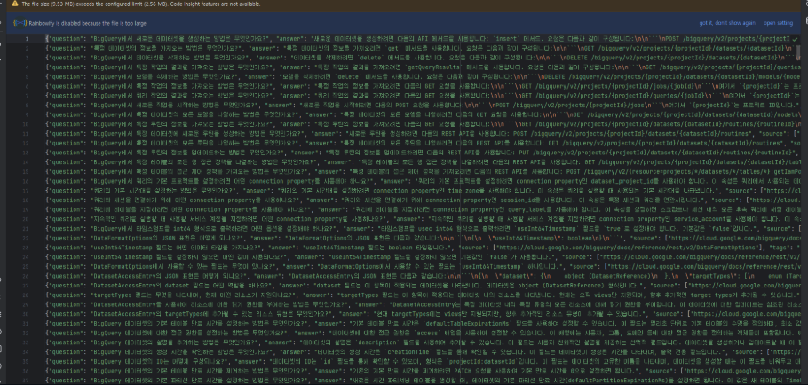

### **🏢 sLLM 파인튜닝용 데이터 전처리**

#### **1. 사내 내부 문서 생성**

| 단계 | 처리 과정 | 세부 내용 |
|:-----|:---------|:---------|
| **1단계** | **문서 사양 정리** | 프론트엔드팀, 백엔드팀, DATA&AI팀, CTO |
| **2단계** | **프롬프트 작성** | 정의된 개발팀 문서를 만들기 위한 프롬프트 작성 |
| **3단계** | **마크다운 생성** | 마크다운으로 생성되도록 요청하며, 정규화 규칙을 프롬프트에 사전 정의 |
| **4단계** | **문서 생성 및 저장** | 각 팀별 사내 문서 생성 후 TXT 파일로 저장 |

**📊 결과물**: 팀별 15개씩 총 60개 사내 문서 (txt 형식)

#### **2. sLLM 파인튜닝용 초기 질문 생성**

##### **2-1. 초기 문서 검색 질문 생성**

| 항목 | 내용 |
|:-----|:-----|
| **목적** | 각 팀별 문서에서 자연스러운 질문을 자동 생성 |
| **방법** | GPT-4o-mini를 활용한 문서 기반 질문 생성 |
| **질문 유형** | • **구체·상세 질문**: "기술적 기여도 평가에서 A/B 테스트 도입이 긍정적인 결과를 가져온 사례를 자세히 설명해 주세요."<br/>• **간결한 질문**: "백엔드 팀 업무 알려줘" |
| **처리 과정** | 1. 각 팀별 문서 폴더 순회<br/>2. TXT 파일을 읽어 문서 내용 추출<br/>3. GPT-4o-mini로 문서 1개 당 질문 5~25개 생성<br/>4. 정규식으로 질문만 추출<br/>5. JSONL 형식으로 저장 |

##### **2-2. 초기 일상 질문 생성**

| 항목 | 내용 |
|:-----|:-----|
| **목적** | 사내 직원이 챗봇에게 할 수 있는 일상적인 질문 생성 |
| **특징** | 문서/보고서 요청 및 기능 설명 제외, 개인 경험 요구 제외, 추천/감상/잡담 위주 구어체 |
| **처리 과정** | 1. GPT-4o-mini로 25개 캐주얼 질문 생성 (6회 반복)<br/>2. 정규식으로 질문 추출<br/>3. 총 150개 일상 질문 확보<br/>4. 모든 팀별 초기 질문 JSONL 파일에 동일 일상 질문 추가 |

#### **3. sLLM 파인튜닝 학습 데이터 생성**

**RAG 기반 대화 데이터 생성 과정 (TOOL CALL 멀티턴)**

| 단계 | 처리 과정 | 세부 내용 |
|:-----|:---------|:---------|
| **1단계** | **벡터 데이터베이스 설정** | BGE-M3 임베딩으로 생성한 사내 문서 Chroma 벡터 DB 로드 |
| **2단계** | **질문 체인 설정** | • 초기 시스템 메시지: 팀/직급별 TOOL PROMPT 차등 적용, 공손한 말투<br/>• 기본 질문 생성: 초기 질문 리스트에서 시작<br/>• 후속 질문(문서 질문): 대화 내역 기반으로 연결 질문 생성<br/>• 후속 질문(일상 질문): 인사/감상, 영상/음악, 운동/스트레칭 등 다양한 의도 포함 |
| **3단계** | **TOOL CALL/RESPONSE 처리** | • **업무 관련 질문**: 문서 검색 필요 → TOOL CALL 구조<br/>• **일상 질문**: 캐주얼 대화 → TOOL CALL 없이 바로 답변 |
| **4단계** | **친구말투 변환** | GPT-4o-mini로 공손말투 답변을 친구말투로 변환 |
| **5단계** | **데이터 통합** | 8개 파일의 데이터를 순차적으로 로드하여 `qwen3_company_train_dataset_combined.json`으로 저장 |

**📊 최종 데이터셋 특성**

| 특성 | 내용                                                                  |
|:-----|:--------------------------------------------------------------------|
| **데이터 규모** | 총 약 2,368개 대화 데이터                                                   |
| **팀별 분포** | Backend, Frontend, Data_AI, CTO (거의 동일 비중)                          |
| **말투 변형** | 공손말투와 친구말투 각각 생성 (동일 비중)                                              |
| **질문 유형 분포** | 업무 관련 질문 : 일상 질문 = 2 : 1 비율                                         |
| **핵심 특징** | 다양한 질문 유형, 자연스러운 대화 흐름, TOOL CALL/RESPONSE 구조, 멀티턴 맥락, 친구말투·공손말투 모두 학습 |


- **[최종 학습 데이터셋 업로드 링크(허깅페이스)](https://huggingface.co/datasets/SKN14-Final-1Team/qwen-finetuning-data-ko-250919)**
- **샘플 데이터:**

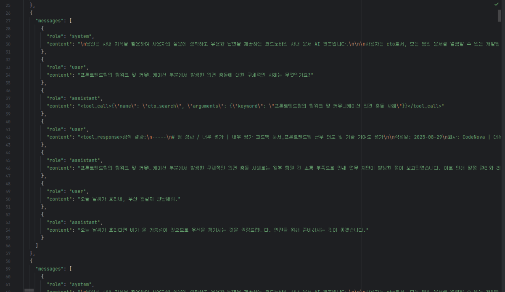

---

## 🔀 ERD
<a id="toc-erd"></a>
> 아래 ERD (Entity-Relationship Diagram)는 **사용자 관리**, **채팅 세션**, **카드 관리**, **메시지 기록** 등을 포함한 주요 테이블 구조를 보여줍니다. 각 테이블은 다음과 같이 연결됩니다:


### 데이터베이스 구조

- 관계형 데이터베이스(RDBMS)로 설계되며, 핵심 테이블은 다음과 같습니다.
  - `user` : 사용자 기본 정보/조직 정보/상태
  - `approval_log` : 사용자 가입 승인/거절 이력
  - `chat_session` : 채팅 세션(제목/모드/소유자)
  - `chat_message` : 채팅 세션 내 채팅 메시지(구분/본문/시각)
  - `chat_image` : 메시지에 첨부된 이미지(aws s3 업로드 링크)
  - `card` : 즐겨찾기 카드(사용자 소유, 채팅 세션과 연결)
  - `card_message` : 카드에 저장되어있는 채팅 메세지
  - `api_key` : 사용자가 저장한 API Key
  - `post` : 커뮤니티 게시글 정보(제목/내용/작성자/조회수/좋아요)
  - `post_likers` : 게시글 좋아요 누른 사용자
  - `comment` : 커뮤니티 댓글 정보(내용/작성자/좋아요)
  - `comment_likers` : 댓글 좋아요 누른 사용자

### 테이블 설명

1) `user` : 사용자 계정 정보

| 컬럼명 | 데이터 타입 | 설명 | 제약 |
|---|---|---|---|
| id | VARCHAR(50) | 사용자 (PK), 로그인 ID | PK, NOT NULL |
| email | VARCHAR(255) | 이메일 | NOT NULL |
| password | VARCHAR(255) | 해시 비밀번호 | NOT NULL |
| name | VARCHAR(100) | 이름 | NOT NULL |
| phone | VARCHAR(30) | 전화번호 | NOT NULL |
| gender | VARCHAR(20) | 성별 | NOT NULL |
| birthday | DATE | 생년월일 | NOT NULL |
| rank | VARCHAR(50) | 직급 | NOT NULL |
| department | VARCHAR(100) | 부서 | NULL |
| status | ENUM('pending','approved','rejected') | 가입 상태 | NOT NULL, DEFAULT 'pending' |
| last_login | DATETIME | 최근 로그인 시각 | NULL |
| created_at | DATETIME | 생성 시각 | NOT NULL |
| updated_at | DATETIME | 수정 시각 | NOT NULL |
| is_active | BOOLEAN | 계정 활성 여부 | DEFAULT TRUE |
| is_staff | BOOLEAN | 스태프 여부 | DEFAULT FALSE |
| profile_image | VARCHAR(500) | 프로필 이미지 URL | DEFAULT 기본 이미지 |

2) `approval_log` : 계정 승인/거절 기록

| 컬럼명 | 데이터 타입 | 설명 | 제약 |
|---|---|---|---|
| id | INT | 로그 PK | PK, AUTO INCREMENT |
| user_id | VARCHAR(50) | 대상 사용자 | FK → user.id, NOT NULL, ON DELETE CASCADE |
| action | ENUM('pending','approved','rejected') | 처리 종류 | NOT NULL |
| reason | VARCHAR(500) | 사유 | NULL |
| created_at | DATETIME | 기록 시각 | NOT NULL |

3) `chat_session` : 채팅 세션

| 컬럼명 | 데이터 타입 | 설명 | 제약 |
|---|---|---|---|
| id | INT | 세션 PK | PK, AUTO INCREMENT |
| user_id | INT | 세션 소유자 | FK → user.id, NOT NULL, ON DELETE CASCADE |
| title | VARCHAR(200) | 세션 제목 | NOT NULL |
| mode | ENUM('api','internal') | 세션 모드 | NOT NULL |
| text_mode | ENUM('formal','informal') | 말투 모드 | NULL |
| created_at | DATETIME | 생성 시각 | NOT NULL |

4) `chat_message` : 채팅 메시지

| 컬럼명 | 데이터 타입 | 설명     | 제약 |
|---|---|--------|---|
| id | INT | 메시지 PK | PK, AUTO INCREMENT |
| session_id | INT | 소속 세션  | FK → chat_session.id, NOT NULL, ON DELETE CASCADE |
| role | ENUM('user','assistant','tool_calls','tool_responses') | 메시지 구분 | NOT NULL |
| content | TEXT | 본문     | NOT NULL |
| created_at | DATETIME | 생성 시각  | NOT NULL |

5) `chat_image` : 채팅 메시지에 첨부된 이미지

| 컬럼명 | 데이터 타입 | 설명 | 제약 |
|---|---|---|---|
| id | INT | 이미지 PK | PK, AUTO INCREMENT |
| message_id | INT | 연결된 메시지 | FK → chat_message.id, NOT NULL |
| image_url | VARCHAR(500) | 이미지 URL | NOT NULL |
| created_at | DATETIME | 생성 시각 | NOT NULL |

6) `card` : 즐겨찾기 카드

| 컬럼명 | 데이터 타입 | 설명 | 제약 |
|---|---|---|---|
| id | INT | 카드 PK | PK, AUTO INCREMENT |
| user_id | VARCHAR(50) | 카드 소유자 | FK → user.id, NOT NULL, ON DELETE CASCADE |
| session_id | INT | 관련 세션 | FK → chat_session.id, NULL, ON DELETE CASCADE |
| title | VARCHAR(200) | 카드 제목 | NOT NULL |
| created_at | DATETIME | 생성 시각 | NOT NULL |

7) `card_message` : 카드-메시지 매핑

| 컬럼명 | 데이터 타입 | 설명 | 제약 |
|---|---|---|---|
| id | INT | 매핑 PK | PK, AUTO INCREMENT |
| card_id | INT | 대상 카드 | FK → card.id, NOT NULL, ON DELETE CASCADE |
| message_id | INT | 대상 메시지 | FK → chat_message.id, NOT NULL, ON DELETE CASCADE |
| position | INT | 카드 내 순서 | NOT NULL |

8) `api_key` : API 키 관리

| 컬럼명 | 데이터 타입 | 설명 | 제약 |
|---|---|---|---|
| id | INT | 키 PK | PK, AUTO INCREMENT |
| user_id | VARCHAR(50) | 키 소유자 | FK → user.id, NOT NULL, ON DELETE CASCADE |
| name | VARCHAR(100) | 키 별칭 | NOT NULL |
| secret_key | VARCHAR(255) | 시크릿 키 | NOT NULL |
| created_at | DATETIME | 생성 시각 | NOT NULL |

9) `post` : 게시물

| 컬럼명 | 데이터 타입 | 설명 | 제약 |
|---|---|---|---|
| id | INT | 게시물의 고유 식별자 | Primary Key |
| title | VARCHAR(200) | 게시물의 제목 | NOT NULL |
| content | TEXT | 게시물의 내용 | NOT NULL |
| author_id | VARCHAR(50) | 작성자의 ID | FK → user.id, NOT NULL |
| created_at | DATETIME | 생성 시각 | NOT NULL |
| updated_at | DATETIME | 수정 시각 | NOT NULL |
| views | INT | 조회수 | NOT NULL, DEFAULT 0 |
| likes | INT | 좋아요 수 | NOT NULL, DEFAULT 0 |

9-1) `post_likers` : 게시물 좋아요 유저 연결 관계

| 컬럼명 | 데이터 타입 | 설명 | 제약 |
|---|---|---|---|
| id | INT | 고유 식별자 | Primary Key |
| post_id | INT | 게시물의 ID | FK → post.id, NOT NULL |
| user_id | VARCHAR(50) | 사용자의 ID | FK → user.id, NOT NULL |

10) `comment` : 댓글

| 컬럼명 | 데이터 타입 | 설명 | 제약 |
|---|---|---|---|
| id | INT | 댓글의 고유 식별자 | Primary Key |
| post_id | INT | 게시물의 ID | FK → post.id, NOT NULL |
| author_id | VARCHAR(50) | 작성자의 ID | FK → user.id, NOT NULL |
| content | TEXT | 댓글 내용 | NOT NULL |
| created_at | DATETIME | 생성 시각 | NOT NULL |
| likes | INT | 좋아요 수 | NOT NULL, DEFAULT 0 |

10-1) `comment_likers` : 댓글 좋아요 유저 연결 관계

| 컬럼명 | 데이터 타입 | 설명 | 제약 |
|---|---|---|---|
| id | INT | 관계의 고유 식별자 | Primary Key |
| comment_id | INT | '좋아요'를 받은 댓글 ID | FK → comment.id, NOT NULL |
| user_id | VARCHAR(50) | '좋아요'를 누른 사용자 ID | FK → user.id, NOT NULL |

---

## 🏅 프로젝트 성과 및 향후 보완점
<a id="toc-achievement"></a>

### **긍정적 성과와 향후 보완점**

#### **🏆 잘한 부분**

| 성과 | 내용                                                                                                        |
|:-----|:----------------------------------------------------------------------------------------------------------|
| **🤖 sLLM 파인튜닝 효과** | Qwen3-8B 모델의 TOOL CALL 성능이 파인튜닝 후 18.83%p 향상되어 98.05%의 tool_selection 정확도 달성                              |
| **📊 RAG 시스템의 높은 성능** | LangGraph RAG 모델(VER-9)은 Context Recall 0.9273, Faithfulness 0.8614, Factual Correctness 0.6940의 높은 성능 보임 |
| **🥇 경쟁 우위 확보** | LangGraph RAG 시스템은 Perplexity 모델 대비 종합 평균 21.11%의 우위를 입증                                                  |
| **🔧 다양한 기능 구현** | 멀티턴 대화, 도메인 특화 자연, 권한 기반 문서 접근 제어, 대화 카드 저장, 커뮤니티 기능 등 실제 활용 가능한 기능들 성공적으로 완성                             |

#### **⚠️ 아쉬운 점**

| 보완점 | 내용                                                                                                              |
|:------|:----------------------------------------------------------------------------------------------------------------|
| **📉 Factual Correctness 지표** | Qwen3-8B 파인튜닝 모델의 Factual Correctness가 0.3709로, Context Recall이나 Faithfulness에 비해 상대적으로 낮은 수치를 보임               |
| **🔄 LangGraph의 답변 속도 최적화 한계** | API 챗봇 LangGraph에서 양생을 검색(유사도+키워드), 환경 쿼리 검색, 쿼리 재생성 및 재검색 후 다시 답변 로직(hyde 가상 답변 기법) 적용으로 정확도는 높아졌으나 답변 속도가 느려짐 |
| **🗃️ 자체 평가 데이터셋의 한계** | 자체 정량 RAG 평가에 LLM으로 생성한 데이터셋을 사용했는데, 이는 실제 사용자 질의의 다양성이나 복잡성을 완전히 반영하지 못할 수 있음                                  |
| **⚙️ 벡터 DB 최신화 로직 미적용** | 구글 API 문서 벡터 DB 최신화 로직을 개발했으나, 시간 부족으로 웹 서비스에 제대로 적용하지 못함                                                       |

---

## 🚀 향후 과제
<a id="toc-future"></a>

| 과제 | 주요 내용 | 세부 내용                                                                                         |
|:-----|:---------|:----------------------------------------------------------------------------------------------|
| **🔧 자동화 develop** | 벡터 DB 최신화 자동화 로직(데이터 수집 → 전처리 → 색인 → 배포)을 실제 웹 서비스에 적용 및 최적화 | • 구글 API 문서 혹은 이외 외부 API 문서의 벡터 DB 최신화를 위한 데이터 수집/전처리/삽입 자동화<br/>• 벡터 DB 최신화 후 배포·롤백 파이프라인 구축 |
| **💡 임베딩모델 파인튜닝** | 사내 도메인 용어와 문서 특성에 맞춰 임베딩 학습으로 검색 정확도 개선 | • 도메인 특화 임베딩 모델 Full-Finetuning<br/>• 파인튜닝 모델 인덱싱 및 서비스 반영, 추가적 재학습 프로세스 마련                   |
| **🧠 응답 형식 다양화** | 문서/업무 맥락에 맞는 표(Table)·목록(Bullets)·절차(Steps)·Q&A·요약(JSON 기반) 등 답변 형식을 다양화 하여 선택 옵션 제공 | • 다양한 출력 형식을 제공하여 사용자 요구에 유연하게 대응<br/>• 출력 형식 스키마 정의(JSON 기반)                                 |
| **🔌 구글 이외 API 추가** | 네이버·카카오 등 다양한 외부 API 연동으로 기능 확장 | • Naver/Kakao 검색·번역 API 연동<br/>• LangGraph 기반 멀티스텝 워크플로우 구축<br/>• 여러 도메인 다양한 작업               |

---


## 💭 팀원 한줄 회고
<a id="toc-retrospective"></a>

| 이름 | 회고                                                                                                      |
|:-----|:--------------------------------------------------------------------------------------------------------|
| **김준기** | 모델을 본인의 테스크에 맞게 파인튜닝하는 방법과 모델이 자체적으로 적절한 Fuction Tool Call를 어떻게 호출하는지 LLM의 내부구조에 대해 알 수 있는 좋은 프로젝트였습니다. |
| **김재우** | 웹페이지의 프론트/백엔드와 DB연결 , AI 학습 등 많은 작업을 통해 6개월 동안 배웠던 것들을 적절하게 체화시킬 수 있어서 좋은 경험이었다고 생각한다.                  |
| **안윤지** |   프로젝트 기획부터 구현까지 전반적인 흐름을 이해할 수 있었고, 랭그래프 성능 개선을 위해 여러 시도를 거쳐 성능 향상을 이룬 보람 있는 경험이었습니다.                                                                                                      |
| **이나경** |    이번 프로젝트는 수업때 배운 내용을 기반으로 LLM을 다각도로 활용해볼 수 있는 좋은 기회가 되었고, 성능 평가 단계의 다양한 방법도 구상해보며 많은 것을 배웠습니다. 또한 프로젝트의 전체 일정을 관리해보며 기술적 역량뿐 아니라 전체 흐름과 마일스톤을 관리하는 역량 또한 매우 중요하다는 것을 깨달았습니다.                                                                                                     |
| **이원지희** | 이번 프로젝트를 통해 Django에서 로그인과 회원가입 기능이 어떤 흐름과 로직으로 구현되는지 직접 경험하며 이해할 수 있었다.                                 |
| **정민영** |    LangGraph 설계부터 sLLM 파인튜닝·평가 자동화·문서화까지 E2E를 주도해 성능과 재현성을 끌어올렸고, 감이 아니라 지표로 개선을 증명하는 법을 배웠다.                                                                                                     |

---
